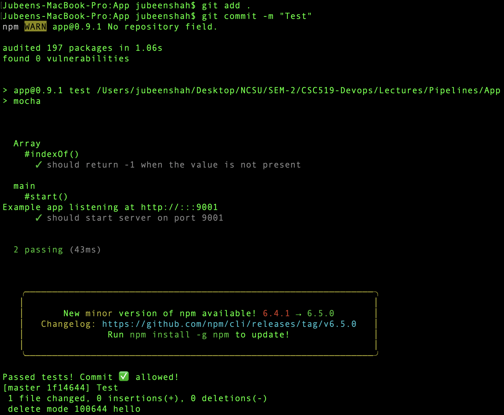
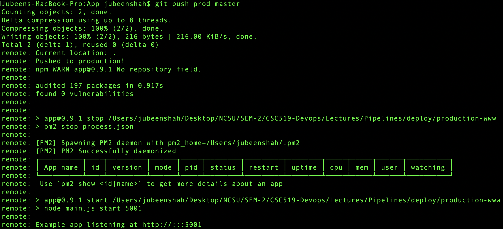
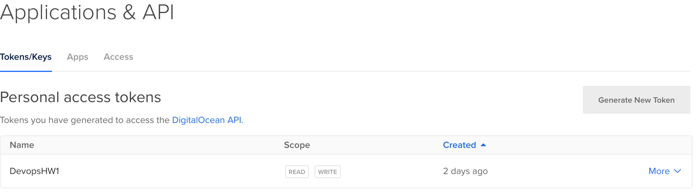
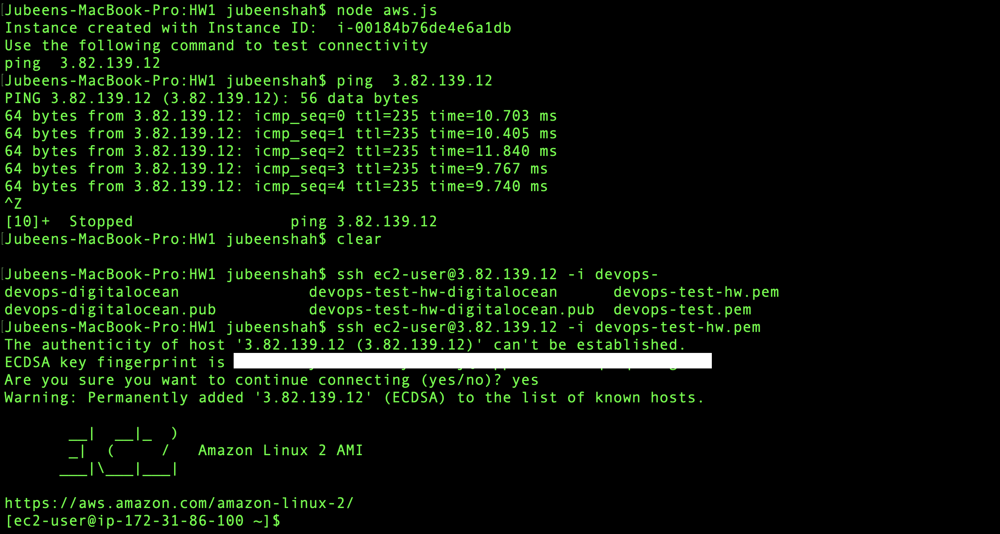
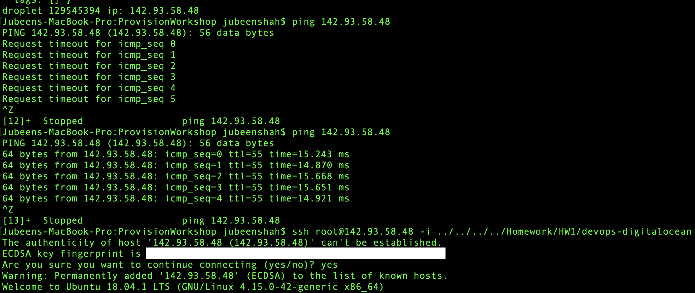

# Devops
Repository For DevOps Homework


| [Jubeen Shah](www.jubeenshah.com) | [JNSHAH2](mailto:jnshah2@ncsu.edu) | [DEVOPS CSC519](https://github.com/CSC-DevOps) |

## Content
1. [HW0 - Pipelines](#hw0-pipelines)
2. [HW1 - Provisioning](#hw1-provisioning)


# HW0-Pipelines

## Content
1. [About the Homework](#about)
2. [Explaining GitHooks](#git-hooks)
3. [Outputs](#output)
4. [Screencast Link](#screencast)

### About
In this homework I've learned to set up a simple delivery pipeline using GIt Hooks. The repo includes [3 types of hook files](#Git Hooks) which were used to help with the understanding and implementation of hooks as means of automating the deployment process. Finally, I also show the [output](#Output) of the same using screenshots followed by the [link to the screencast](https://youtu.be/WlYsmlYm36w?t=29)  of the entire process.

### Git Hooks
1. **Pre-Commit** - In this a simple script was written that would execute a test using `npm test` to check whether or not a particular commit is allowed or not. If the test fails, the commit would be cancelled, and accepted otherwise. [Link to Script](./Scripts/pre-commit)
```shell
#!/bin/bash

npm install
# Get the exit code of tests.
if npm test; then
echo "Passed tests! Commit ✅ allowed!"
exit 0
fi
echo "Failed npm tests. Canceling 🚫 commit!"
exit 1
```

2. **Post-commit** - In this another script was written that would simply execute a `post-commit` hook that would simply open a webpage, in this case [`www.google.com`](https://www.google.com). So as soon as a commit is made, the `post-commit` hook would execute a task, this could be anything. [Link to Script](./Scripts/post-commit)

```shell
#!/bin/sh

# In Mac
open https://google.com/
```


3. **Post-receive** - A hook script was written to to copy the updated code from the deployment environment to the production environment, after a link was setup between the two. [Link to Script](./Scripts/post-receive)

```shell
#!/bin/sh
echo "Current location: $GIT_DIR"
GIT_WORK_TREE=../production-www/ git checkout -f
echo "Pushed to production!"
cd ../production-www
npm install --production
npm run stop
npm run start
```


### Output

1. **Pre-Commit** 

2. **Post-Receive**

3.  The test results using `opunit verify local` (100% Pass)

4. Finally test results using `opunit profile CSC-DevOps/profile:519.yml` (100% Pass)


### Screencast
* [YouTube](https://youtu.be/WlYsmlYm36w?t=29)


# HW1-Provisioning

## Content
1. [About the homework](#about-the-homework)
2. [Cloud Providers used](#cloud-providers)
3. [Installing dependencies](#installing-dependencies)
1. [Amazon Web Services](#amazon-web-services)
2. [DigitalOcean](#digitalocean)
4. [Running the programs](running-the-programs)
1. [Amazon Web Services](#aws)
2. [Digital Ocean](#do)
5. [Screencast Link](#screencast)

## About the homework

In this homework assignment, I have completed the following tasks:

* Automatically provision using a code api from two [cloud providers](#cloud-providers). 
* The provisioning code is able to perform the following:
* create a new VM, with a registered ssh key. This allows the user to ssh directly into the user's account without being emailed a temporary root password.
* print out the ip address of the new server.

## Cloud Providers

The cloud providers used in the homework are:

* [DigitalOcean](https://www.digitalocean.com)
* [Amazon Web Services](https://aws.amazon.com)


## Installing dependencies

Both these cloud providers have different set of requirements that need to be fulfilled so that you can use this program on your machine. In this section I would try to explain which dependencies are needed for you to run this program.

### Amazon Web Services

Firstly, you would need to install the [node aws-sdk package](https://www.npmjs.com/package/aws-sdk). This is the official AWS SDK for JavaScript, available for browsers and mobile devices, or Node.js backends. This package can be installed using the Node Package Manager using the command:

```shell
npm install aws-sdk
```
> If you need to install `npm` on your machine you can click on this link to [start the download (macOS)](https://nodejs.org/dist/v10.15.0/node-v10.15.0.pkg) or this link to [visit the webpage](https://www.npmjs.com/get-npm)

Alternatively, you can run `npm install` in the [AWS folder](./AWS/)

You would now need to install the AWS command line interface to use your machine's terminal as way to interact with AWS. This installation can be done using the following command:

```
pip install awscli --upgrade --user
```
> If you need to install `pip` on your machine you can do it using the following set of commands: 
```
curl https://bootstrap.pypa.io/get-pip.py -o get-pip.py 
```
```
python get-pip.py
```

You can also use the following set of commands if you're getting the `aws command not found` error.
```shell
curl "https://s3.amazonaws.com/aws-cli/awscli-bundle.zip" -o "awscli-bundle.zip"
```

```shell
unzip awscli-bundle.zip
```

```shell
sudo ./awscli-bundle/install -i /usr/local/aws -b /usr/local/bin/aws
```

Once the AWS-CLI is set up on the machine, you would need to configure the profile using your credentials that you would obtain from AWS. To get a detailed explaination you can visit the [official documentation to configure AWS CLI](https://docs.aws.amazon.com/cli/latest/userguide/cli-chap-configure.html).

Once configured you can run the [`aws.js`](./AWS/aws.js). You can see the [next section]() that provides screenshots for the same.

### DigitalOcean

To use DigitalOcean you can first `cd DigitalOcean` and then `npm install` to install the dependencies and set-up a preliminary environment.

Then you would need to set your token that you would be able to access, once you've setup your account on DigitalOcean under the API section once you login, where you can click the `Generate New Token` option



Once you've got your token, you can use the following command to set your token, where `xxx` would be the token that you would get.

```shell
export DOTOKEN="xxx"
```

When using digitalocean, you must be able to obtain your own [`api key`](https://www.digitalocean.com/docs/api/create-personal-access-token/) after creating an account. 

To create and register a ssh key, you can first create your ssh key locally, then [add your public key to DO](https://www.digitalocean.com/docs/droplets/how-to/add-ssh-keys/).

In your createDroplet code, you will need to change the `"ssh_keys":null`, entry to add the id associated with your ssh key.

You can retrieve the associated id using the api where `xxx` is the token that you generate. 

```
curl -X GET https://api.digitalocean.com/v2/account/keys -H "Authorization: Bearer xxx"
```
Finally, you can change the code to use the id: `"ssh_keys":[12345...]`.


## Running the Programs

In this section I would discuss the steps needed to execute the program and any other step that would be necessary to ping or SSH into the virtual machine created.

### AWS

You should `cd AWS` and then `node aws.js`. This would simply create an `EC2 instance`. The program is set up in such a way that it would associate a security group with the created instance. This security group allows two things specifically. inbound ICMP traffic and SSH traffic. 
* ICMP would allow us to ping the instance created using the public IPV4 address. 
* The inbound SSH traffic allows us to logging into the EC2 instance. To facilitate this we need to associate a keypair with the instance, that would allow us to log into the server without the need for a username and password.



### DO

You should `cd DigitalOcean` and then `node main.js`. This would create a `Droplet` with a `Droplet ID`. This droplet ID is then used to obtain the IP address that we can use to ping the instance and subsequently SSH into it. However, to be able to SSH into the DigitalOcean Droplet, you should first follow the steps mentioned in the [previous section](#digitalocean), to ensure you have the SSH key setup with both the public and private key.

Once set up, and having created the `droplet`. You can SSH into the instance using the following instruction.

```shell
ssh root@xx.xx.xx.xx -i /path/to/private/key
```



## Screencast

* [YouTube](https://youtu.be/04XmI_vpJzc)

